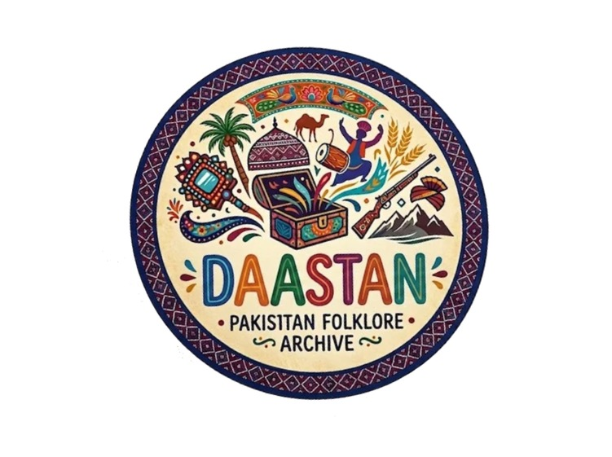

# DAASTAN - Pakistan Folklore Archive

<div align="center">



**Preserving Pakistan's Living Heritage Through Technology**

[](LICENSE)
[](CONTRIBUTING.md)

</div>

---

##  WHY We Exist

<div align="center">

### The Belief

</div>

Pakistan's living heritage — the stories told around fires, in homes, at festivals — are disappearing. As languages evolve and oral traditions fade, we use technology to preserve, celebrate, and reimagine these narratives — ensuring every community's voice remains part of our shared future.

> *"Stories are the DNA of a civilization. We are its engineers."*

---

## 🔧 HOW We Work

<div align="center">

### The 3 Principles

</div>

<table>
  <tr>
    <td align="center" width="33%">
      <h3>01</h3>
      <h4>Cultural Integrity First</h4>
      <p>Every story is researched and documented with respect for its original context, language, and community ownership. <strong>Authenticity before adaptation.</strong></p>
    </td>
    <td align="center" width="33%">
      <h3>02</h3>
      <h4>Technology as Preservation</h4>
      <p>We use animation, interactive media, AI-assisted documentation, and immersive experiences to transform fragile oral traditions into accessible digital heritage.</p>
    </td>
    <td align="center" width="33%">
      <h3>03</h3>
      <h4>Inclusion Across Languages</h4>
      <p>Pakistan's heritage belongs to all. We actively represent stories from Punjabi, Sindhi, Pashto, Balochi, Saraiki, Hindko, Kashmiri, Brahui, and more.</p>
    </td>
  </tr>
</table>

---

## 📦 WHAT We Create

<div align="center">

### Our Outputs

</div>

| Output | Description |
|--------|-------------|
| **🎬 Digital Storytelling** | Animated films, motion comics & interactive narratives inspired by folk tales, myths, and oral histories. |
| **📚 Cultural Archive** | Searchable digital repository of recorded stories, transcripts, linguistic resources & historical references. |
| **🎮 EdTech Modules** | Interactive learning platforms, games, and digital exhibits that make cultural heritage engaging for youth. |
| **🥽 Creative Technology** | AR, VR, and AI-powered storytelling tools that bring traditional narratives into contemporary formats. |

---

##  Mission & Vision

### Mission
To preserve, celebrate, and reimagine Pakistan's diverse cultural heritage through technology — ensuring every story, language, and tradition remains alive for future generations.

### Vision
A future where every community's stories are digitally preserved, globally accessible, and continuously inspiring new generations of creators, learners, and storytellers.

---

## 💎 Core Values

| Value | Description |
|-------|-------------|
| **🛡️ Preservation** | Safeguarding stories before they disappear forever |
| **✨ Authenticity** | Representing cultures with care and historical accuracy |
| **🌍 Accessibility** | Making heritage available to everyone, everywhere |
| **🤝 Inclusivity** | Every language, region, and community matters equally |
| **💡 Innovation** | Using emerging technology to keep traditions alive |

---

## 🎨 Brand Identity

### Logo & Identity
The DAASTAN logo features vibrant Pakistani folk art inspired by truck art aesthetics, showcasing cultural symbols including palm trees, camels, musical instruments, traditional architecture, and a treasure chest representing the archive of stories — all enclosed in decorative border patterns inspired by Pakistani tile art.

### Color Palette

| Color | Hex Code | Usage |
|-------|----------|-------|
| Heritage Gold | `#C9952A` | Primary branding, headings, accents |
| Rust Orange | `#BB4A1E` | Highlights, CTAs, secondary elements |
| Deep Indigo | `#2D2A5E` | Borders, secondary elements |
| Forest Green | `#4A6741` | Natural/cultural elements |
| Cream | `#F0DEB8` | Backgrounds, light text |

### Typography
- **Headings:** Cormorant Garamond — Elegant serif for titles & headings
- **Body:** Inter / Arial — Clean, modern sans-serif for readability

### Tone of Voice
- **Respectful** — Honoring cultural heritage with dignity
- **Imaginative** — Bringing ancient stories to life
- **Warm** — Inviting, inclusive, and community-focused

---

## 🚀 Getting Started

### Prerequisites
- Node.js (v16 or higher)
- npm or yarn
- Git

### Installation

```bash
# Clone the repository
git clone https://github.com/yourusername/daastan.git

# Navigate to project directory
cd daastan

# Install dependencies
npm install

# Start development server
npm run dev
